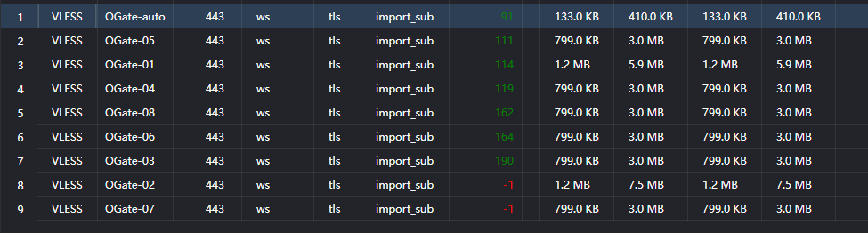

# cf-worker-openvpn

把 **VPN Gate 的公共 OpenVPN(TCP) 节点**，用**一个纯 Cloudflare Workers JS** 变成 v2rayN / mihomo 可以直接订阅的**多出口 VLESS 节点**。

一条订阅链接 → 9 个节点 → 每个节点走**不同的 OpenVPN 出口 IP**。

```
v2rayN ──VLESS(WS/TLS)──> CF 边缘 ──> Worker ──用户态 IPv4/TCP──> OpenVPN(TCP,纯JS) ──> VPN Gate 节点 ──> 目标
```

## 实测

v2rayN 订阅后的延迟测试（同一条订阅，9 个节点）：



`OGate-auto` 81ms，其余可用节点 111～190ms，9 个里 7 个可用（2 个 `-1` 见下文「已知不足」）。

> 注意：这个成绩的前提是**客户端到 CF 边缘这一段路由要好**。同一套代码，从作者本机直连测是 10～20 秒，把去 Worker 的连接塞进一条日本线路后立刻变成 1.54 秒。**Worker 本身不慢，慢的是你到 CF 边缘的那条腿**（v2rayN 里给节点指定一个日本 CF 边缘 IP 收益极大）。

## 特性

- **VLESS over WebSocket + TLS**：`cmd=1`(TCP)、`cmd=3`(mux 帧解析已实现，见不足)、early data(`sec-websocket-protocol`)、头跨 WS 帧分片自动缓冲
- **用户态 IPv4/TCP 栈**（`src/tcp.js`）：SYN/状态机、累计 ACK、乱序缓存与去重、RTO 指数退避重传、FIN/RST、校验和验证、IPv4 分片拒绝、MSS 协商
- **纯 JS OpenVPN TCP 客户端**（`src/openvpn/`）：可靠控制通道、TLS 握手、key_method 2、PUSH_REPLY 解析、数据通道 AES-128-CBC + SHA1 HMAC
- **隧道多路复用**（`TunnelMux`）：一条 OpenVPN 隧道承载多条客户端 TCP 流，按本地端口分发；空闲时 2.5 秒发一次 OpenVPN ping 保活（VPN Gate 推的是 `ping 3,ping-restart 10`）
- **出口槽位制**：`/e1`…`/e8` 每个槽位一条独立隧道、独立出口 IP；`/auto` 是自动池（轮流用最空闲的出口）
- **节点自动轮换**：Worker 内实时拉取 VPN Gate 列表（60 个 TCP 可用节点，10 分钟缓存）、失败黑名单、拨号前用 connect RTT 预筛；槽位 key 永不变，所以**节点死了自动换、已分发的订阅链接不用改**
- **一条订阅给全部节点**：`/sub` 返回 base64 订阅（含 8 个出口槽位 + 1 个 auto）

## 用法

```
# 订阅地址（v2rayN：订阅分组设置 → 添加订阅 → 粘贴 → 更新）
https://<你的域名>/sub

# 诊断
/version    构建版本 / UUID / 路由列表
/nodes      实时节点表大小与年龄、黑名单、每个槽位当前绑定的节点（?refresh=1 强制刷新）
/tunnel     当前 isolate 里活着的隧道（出口/隧道IP/流数/年龄）
/ping       纯 connect 延迟测量：/ping?host=1.1.1.1&port=80&n=3
/exit-test  走缓存出口跑一次 HTTP 并返回分阶段耗时（拨号/SYN/首字节）
/ovpn-test  用给定或内嵌配置做完整 OpenVPN+HTTP 测试（返回各阶段耗时）
/sock-test  裸 TCP 连通性测试
/trace      进程内环形日志（前端每个阶段都记录在这里）
```

部署：`node build.js` 生成 `_worker.js`，然后用你惯用的方式上传（本项目用 Cloudflare API `PUT /accounts/{acct}/workers/scripts/{name}`，见 `local/cfdeploy.js`）。

## 已知不足（欢迎改进 / PR）

1. **mux.cool 还没打通 —— 影响最大的一条。**
   v2rayN 默认开启 mux，此时客户端发的是 `cmd=3`。已按 Xray 源码修正两处致命格式错误：
   VLESS 的 mux 请求**不带 port/地址**（旧解析器把它当「地址类型 0」直接拒绝，这就是默认配置完全连不通的原因）；
   以及 `End`/`KeepAlive` 帧**没有 dataLen 字段**（多写 2 字节会让客户端帧读取器错位）。
   **但端到端仍然是 000**，说明还有一处帧/会话细节没对上。缺的是一个能从**同一个 isolate** 抓到客户端首帧字节的工具（CF 会把请求打散到不同 isolate，`/trace` 常常抓不到）。
   → 打通后一条长连接能让隧道永不冷掉，是最有价值的改动。**当前请在 v2rayN 里关闭 mux。**
2. **每条新连接可能都要重做一次 OpenVPN 握手（1.1～3.5 秒）。** CF 在请求结束时回收 outbound socket，状态又是 per-isolate 的，所以隧道很难跨请求热起来（实测连续请求会落到不同 isolate）。这决定了「冷」时的延迟下限。
3. **VPN Gate 的 `ping-restart 10`。** 服务端 10 秒收不到数据就重启会话；isolate 一空闲，保活 `setInterval` 就不再被调度 → 隧道必死。已用「超过 7 秒没碰过就判定已死、立即重拨」减轻（否则会白等超时再重拨，正好越过 v2rayN 的 5 秒测试超时）。
4. **没有 UDP/QUIC。** CF Workers 的 `connect()` 只有 TCP，所以 UDP 流量不支持。
5. **纯 JS 加解密**（无 AES-NI）+ 每请求 CPU 时间限制 → 吞吐受限，大文件慢。
6. **用户态 TCP 不完整**：无窗口缩放（65535 上限）、无 SACK、无真正的拥塞控制（固定 RTO 1000ms 起、250ms tick）。
7. **节点池质量**：VPN Gate 现在全网 TCP 可用节点 JP=42 / KR=37，**美国只有 1 个且握手失败**；志愿者节点上下线频繁。
8. **没有跨 isolate 的共享状态**（未接 KV）：实时节点表和热隧道都只在单个 isolate 内有效，这会让第 2、3 条的症状更明显。接 KV 是明确可做的下一步。

## 目录

```
src/worker.js          入口（把 execution context 传下去，用于 waitUntil 保活）
src/handler.js         路由 + VLESS 前端状态机 + mux.cool + 出口槽位/轮换 + 诊断端点
src/vless.js           VLESS 头解析（cmd=1/3）
src/tcp.js             用户态 IPv4/TCP + 隧道多路复用器
src/openvpn/           OpenVPN TCP 客户端（控制通道/TLS/key_method2/数据通道/加密）
src/nodes.js           实时 VPN Gate 节点源 + 黑名单 + connect RTT 预筛
src/embedded-ovpn.js   内嵌引导配置（引导用，运行时会用实时列表轮换）
build.js               极简 ESM 打包器 → _worker.js
test/                  单元与集成测试（node test/run.js）
local/                 作者的调试/测量脚本（bench-nodes / pick-exits / us-probe / xray-from-sub 等）
```

## 许可

MIT。OpenVPN 配置与节点来自 [VPN Gate](https://www.vpngate.net/)（筑波大学学术实验项目），本项目只调用其公开 API 与公开节点列表，不修改也不代理其服务；使用时请遵守 VPN Gate 条款与所在地法律。
